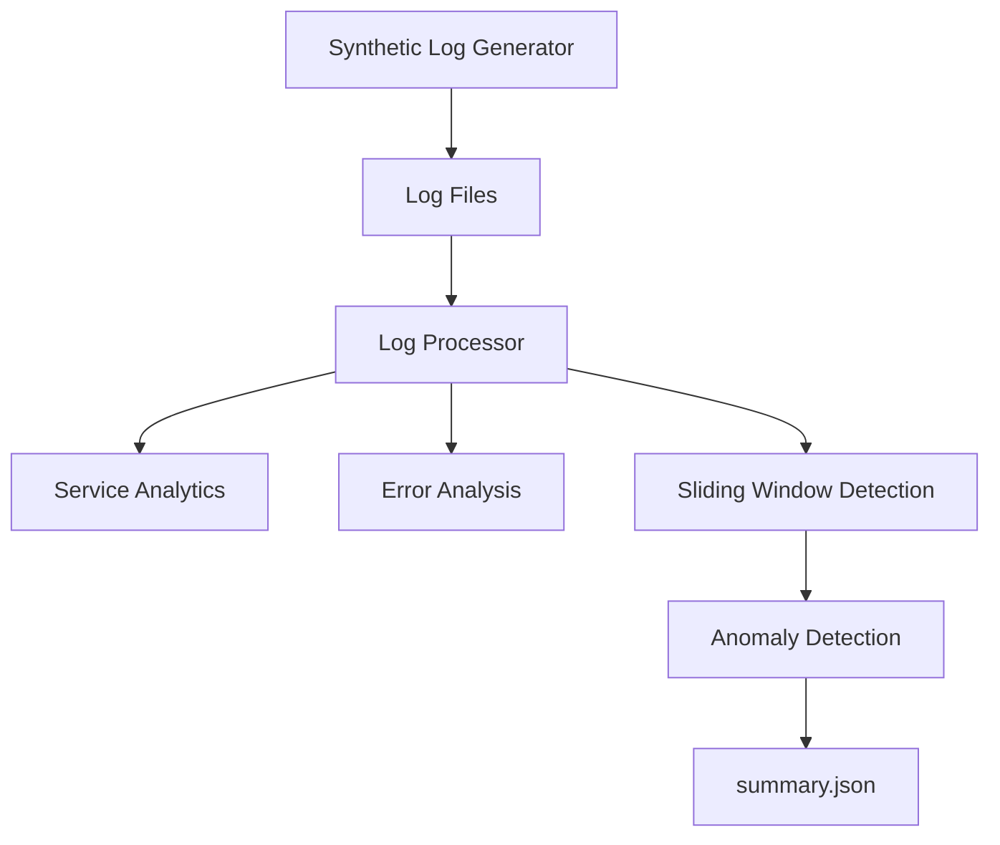
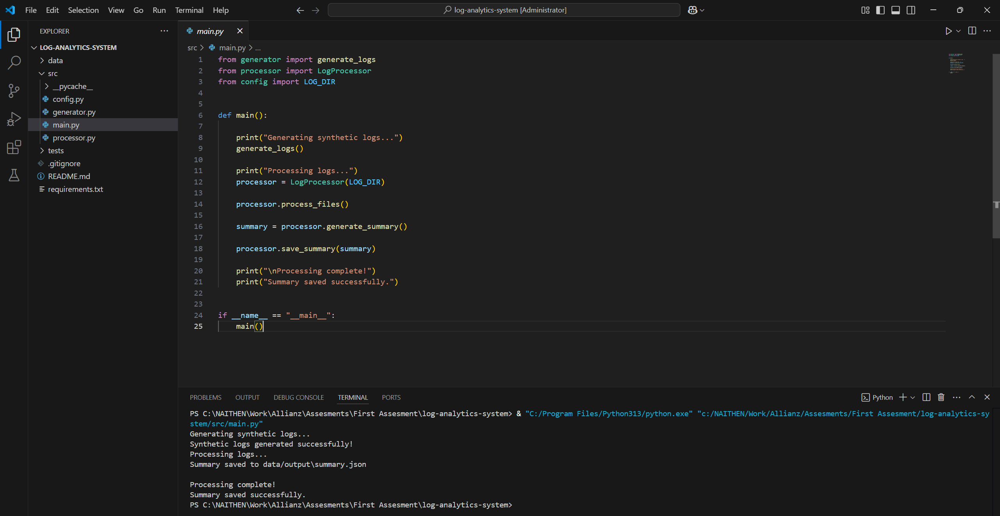
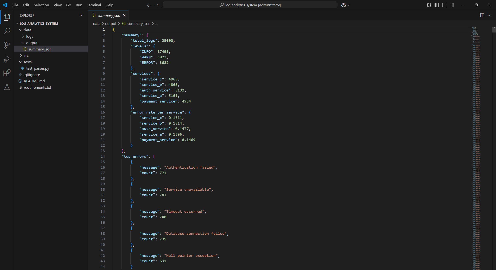

# Log Analytics and Anomaly Detection System

## Overview

This project implements a streaming log analytics pipeline that processes large volumes of application logs efficiently using constant-memory techniques.

The system generates synthetic application logs, processes them in a streaming manner, detects anomalies using a sliding time window, and produces summary analytics in JSON format.

## Architecture



## Features

* Synthetic log generation
* Streaming log processing
* Log parsing and validation
* Service-level analytics
* Error frequency analysis
* Top-K error detection
* Sliding window anomaly detection
* JSON summary report generation

## Project Structure

```text
log-analytics-system/
│
├── README.md
├── requirements.txt
├── .gitignore
│
├── data/
│   ├── logs/
│   └── output/
│
├── src/
│   ├── config.py
│   ├── generator.py
│   ├── processor.py
│   └── main.py
│
└── tests/
    └── test_parser.py
```

## Technologies Used

* Python
* deque
* defaultdict
* Counter
* JSON
* Streaming Processing

## Concepts Demonstrated

* Data Engineering Fundamentals
* Log Processing Pipelines
* Sliding Window Algorithms
* Anomaly Detection
* Fault Tolerance
* Memory-Efficient Streaming
* Time-Series Analytics


## Execution Example



## Sample Summary



## Future Improvements

* Real-time log ingestion
* Kafka integration
* Dashboard visualization
* Alerting system
* Distributed processing support
* Machine-learning-based anomaly detection

